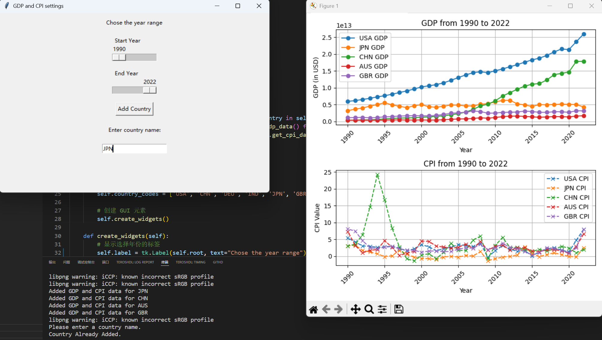

# 深度学习实践HW2  实验报告

PB22000246 翁正朗

## 实验内容

输入某个国家的名字，输出该国的1990-2022的GDP（再加一个其他项目）折线图，时间段可调

## 功能介绍

1. 从https://www.imf.org/en/Data网站获取各个国家的GDP和CLI(Consumer Price Index，消费者物价指数)，通过图形化界面输入国家的ISO代码，从而添加该国GDP和CLI曲线。
2. 通过滑动条调整显示的时间段
3. 国家代码的输入框带有异常检测，输入为空、代码不正确、国家已添加时给出对应提示
4. 国家代码的输入框可自动剔除前导和后导的空格、制表符、换行等




## 视频展示

详见附件中的视频，视频展示了添加多个国家的数据，调整显示时段。当输入有误时，可在集成终端中看到相应错误提示。


## 设计的类

工程包含两个文件

```shell
main.py
gdp_data.py
```

两个文件各定义了一个类：

```python
# gdp_data.py
class GDPData:	
    def __init__(self, country):
        #...
    def get_gdp_data(self):
        #...
    def get_cpi_data(self):
        #...
    #使用requests库实现网络数据的获取
    #具体获取了GDP和CPI(Consumer Price Index) 消费者物价指数


# main.py
class GDPGraphApp:
    def __init__(self, root):
        #...
    def create_widgets(self):	#使用tkinter库创建GUI中各个交互按键
        #...
    def add_country(self):		#添加国家
        #...
    def update_plot(self, event=None):	#更新图表
        #...
```


## 代码

详见github  [langlang-02/hw2-GDP](https://github.com/langlang-02/hw2-GDP)


## 收获和感受

1. 加深的类的功能的理解，例如继承父类。

2. 尝试了新的字典初始化方法：

    ```python
    self.gdp_data = {country: GDPData(country) for country in self.countries}   #
            self.data = {country: self.gdp_data[country].get_gdp_data() for country in self.countries}
            self.cpi_values = {country: self.gdp_data[country].get_cpi_data() for country in self.countries}  # 新增CPI数据获取
    ```

3. 实验用到的各种知识上课根本没细讲，几乎完全是自学。。。希望有更多的代码细节讲解。这样一次作业又要写报告又要录视频还要push到github上，要求好奇怪，工作量略微有点大。无法理解这和深度学习实践有什么关系。

